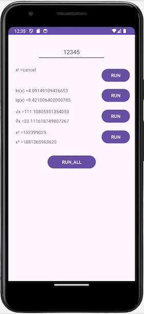
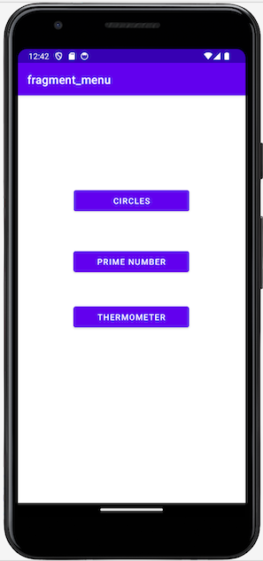

# Содержание и описание репозитория  
Репозиторий содержит несколько реализаций на языке Kotlin для Android.  

   1. [Compose](#1-Compose) 
   2. [Coroutines](#2-Coroutines)  
   3. [Architecture](#3-Architecture)   

## 1. Compose

Это приложение написано для личного использования.  
Приложение генерирует разные неслучайные пароли для различных доменных имен на основе одного ключевого слова.  

Описание приложения:  
1) реализовано на основе шаблона MVVM  
2) графическая часть реализована с использованием Jatpack Compose  
3) различные варианты написания одного доменного имени ("https://mail.ru/", "mail.ru", "mail") интерпретируются одинаково  
4) реализована возможность вставлять доменное имя из буфера, копировать сгенерированный пароль в буфер  

## 2. Coroutines

Учебное приложение производит вычисления некоторых математических функций:  
- определение факториала,  
- нахождение натурального и десятичного логарифма,  
- возведение числа в квадрат и в куб,  
- извлечение квадратного и кубического корня  

Описание приложения:
1) реализовано на основе шаблона MVVM  
2) наблюдение за состоянием объекта производиться с помощью горячих потоков  
3) вычисления производятся внутри сопрограмм  
4) вычислительные функции используются самописные, в них добавлена возможность приостановки вычисления  
5) вычислительные функции обеспечены тестами  

## 3. Architecture  

Учебное многомодульное приложение, производящее 3 вида вычислений:  
- определение взаиморасположения 2-х окружностей  
- восходящее (справа на лево) или нисходящеен (слева на право) разложение натурального числа на порязрядные группы с определением, является ли новое число простым  
- пересчет температуры в выбранной системе счисления с рекомендациями по её изменению  

Описание приложения:
1) разделено на 5 модулей
2) функциональные модули (circles, primenumbers, thermometer) разделены на 2 слоя: слой бизнес-логики (Domain Layer) и слой представления (Presentation Layer)
3) выделение бизнес-логики в отдельный слой позволило реализовать тестирование с помощью обычных тестов на JUnit
4) реализована навигация между фрагментами  
5) в виде общего модуля реализованы object Loger и базовый class Module, которые обеспечивают вывод учебной информации об этапе жизненного цикла функционального модуля  

